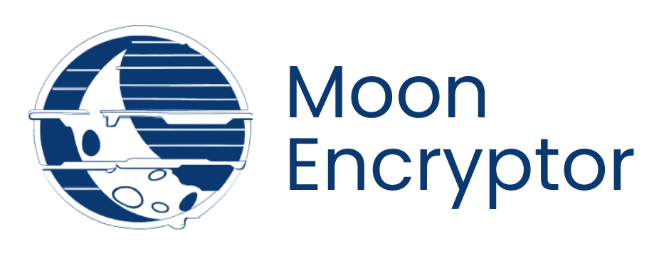

# Moon Encryptor

This is a project I undertook to learn and hone my skills in Javascript, HTML, and CSS. The project is an optional challenge proposed by ONE in collaboration with Alura LATAM.

## What is the challenge about?
The challenge consists of creating an application where the user enters a message, and then the program encrypts the message with certain rules and returns the encrypted message. The encryption rules are as follows:

* The letter *"e"* is converted to *"enter"*
* The letter *"i"* is converted to *"imes"*
* The letter *"a"* is converted to *"ai"*
* The letter *"o"* is converted to *"ober"*
* The letter *"u"* is converted to *"ufat"* 

 

Additionally, it was required that the program only accepts lowercase text without any accents or special characters. It was also requested that the encrypted text can be decrypted to its original version, and it is preferred that the page be responsive.

A design was proposed for the graphical interface of the application from which I took many references to create my own design. If you want to see the proposal, it is available on the following [Figma Link.](https://www.figma.com/file/g27LFmoX9mR5D8yCfWzEl9/Alura-Challenge---Desaf%C3%ADo-1---L%C3%B3gica?type=design&node-id=0%3A1&mode=design&t=5B0p5fdhk7wHzaK8-1)

## What did I learn from this project?
Well, first of all, this is the first project I've done entirely on my own; without copying the process from any course and writing the code myself and on my own. Therefore, the difference in learning is incredibly vast because now I am the one defining each element and interaction in my code, and I can say that I noticed it a lot.

Before starting the project, I only knew how to structure the page in HTML (in a very non-semantic way), apply basic styles and a few more details with CSS, and as for Javascript I practically knew nothing (although currently I don't know much more than what is seen in the project; I will continue learning). So, as I wanted to make a project worthy of my devotion, I had to learn to code everything I had in my mind. However, I wanted to start with good practices from the beginning, so before everything, I learned about semantic HTML, BEM methodology, Git Flow and Trunk Based Development (although I ended up using a combination of both), semantic versioning, and others.

Once I made sure to have a reasonably clear organization thanks to these knowledge, now I faced the code, and practically everything you will see in the project that I have not mentioned until now was what I learned to do.

## What was the goal of this project?
My main goal for this project was to learn because when it comes to learning, there is no comparison between doing a project on your own vs. just writing the code for a project you see in a course.

Now, as I wanted to learn a lot, I was also very detailed, and I wanted to add as many features as possible, although without losing the sense of the application or being overwhelming with content. That's why I not only settled for what the challenge guide asked for, but also added a dark mode, a language menu, invented a logo, and even added two additional encryption modes, and all of this along with the entire ecosystem that these features have behind to work efficiently and bug-free, all for a rich and comfortable user experience.

It took me 3 weeks to make this application, and maybe I could have taken much less time, but my intention was not to finish quickly but to learn as much as possible with every problem that arose, every extra detail I wanted to add, and get the most out of every new thing that presented itself to me; that's why I am satisfied because I definitely achieved my goal with this project.

## Extra message for programmers
If you want to review my code, feel free to do so. I made an effort to structure the project comfortably to read and understand; I also added explanations in practically all the features you will see so that you can quickly and comfortably understand what each functionality does, and even in several of them, I added a step-by-step of the process it performs.

If you have any ideas or proposals to improve/optimize my code or any comments that would add value to my work, feel free to communicate it to me if that is your intention; it helps me a lot.

 
 

---

# Español

 

# Moon Encryptor

Este es un proyecto que realicé para aprender y practicar Javascript, HTML y CSS. El proyecto es un challenge opcional propuesto por ONE en colaboración con Alura LATAM.

## ¿En qué consiste el challenge?
El challenge consiste en realizar una aplicación en donde el usuario ingrese un mensaje, luego el programa encripta el mensaje con ciertas reglas y devuelve el mensaje encriptado. Las reglas de encriptación son las siguientes:

* La letra *"e"* es convertida para *"enter"*
* La letra *"i"* es convertida para *"imes"*
* La letra *"a"* es convertida para *"ai"*
* La letra *"o"* es convertida para *"ober"*
* La letra *"u"* es convertida para *"ufat"* 

 

Adicional a esto, se pidió como requisito que el programa únicamente pueda recibir texto en minúsculas, sin acentos de ningún tipo ni caracteres especiales. También se pidió que el texto encriptado pueda ser desencriptado a su versión original y que preferiblemente la página sea responsive.

Se propuso un diseño para la interfaz gráfica de la aplicación del cual saqué bastantes referencias para realizar mi propio diseño. Si quieres ver la propuesta, está en el siguiente [Link de Figma.](https://www.figma.com/file/g27LFmoX9mR5D8yCfWzEl9/Alura-Challenge---Desaf%C3%ADo-1---L%C3%B3gica?type=design&node-id=0%3A1&mode=design&t=5B0p5fdhk7wHzaK8-1)

## ¿Qué aprendizaje obtuve de este proyecto?
Bueno, antes que nada este es el primer proyecto que hago yo mismo; sin copiar el proceso de ningún curso y escribiendo el código yo mismo y por mi propia cuenta. Por lo tanto, la diferencia en aprendizaje es increíblemente abismal porque ahora soy yo quién debe definir cada elemento e interacción de mi código, y puedo decir que lo noté bastante.

Antes de comenzar a hacer el proyecto, únicamente sabía estructurar la página en HTML (de manera muy poco semántica), aplicar estilos básicos y uno que otro detalle más con CSS, y en cuanto a Javascript prácticamente no sabía nada (aunque actualmente tampoco sé mucho más que lo que se ve en el proyecto; continuaré aprendiendo). Siendo así, y como yo quería hacer un proyecto digno de mi devoción, tuve que aprender a hacer en el código todo lo que tenía en mi cabeza para que lo fuera. Sin embargo, quise empezar con buenas prácticas desde un principio así que antes de todo aprendí sobre HTML semántico, metodología BEM, Git Flow y Trunk Based Development (aunque al final terminé utilizando una combinación de ambas), versionado semántico y entre otras.

Una vez me aseguré de tener una organización medianamente clara gracias a estos conocimientos que acabo de describir, ahora sí me enfrenté al código y prácticamente todo lo que verás en el proyecto que no haya mencionado hasta ahora fue lo que aprendí a hacer.

## ¿Cuál fue el objetivo de realizar este proyecto?
Mi objetivo principal para realizar este proyecto fue aprender, porque a la hora de querer aprender no hay punto de comparación entre hacer un proyecto por ti mismo vs. simplemente escribir el código de un proyecto que vez en un curso.

Ahora bien, como quería aprender bastante también fui muy detallista y quise agregar la mayor cantidad de funcionalidades posibles, aunque sin perder el sentido de la aplicación ni ser empalagoso con el contenido. Es por eso que no solo me conformé con lo que pedía la guía del challenge sino que también agregué un modo oscuro, un menú de idiomas, me inventé un logo e incluso agregué dos métodos de encriptación adicionales, y esto junto con todo el ecosistema que estas funcionalidades tienen detrás para funcionar eficientemente y libre de bugs, todo en pro de una experiencia rica y cómoda para el usuario.

Demoré 3 semanas para hacer esta aplicación y quizá me pude haber demorado bastante menos, pero mi intención no era acabar rápido sino aprender todo lo posible con cada problema que me surgía, cada detalle extra que quise agregar y sacarle todo el jugo a cada cosa nueva que se me presentaba; por eso estoy satisfecho, porque definitivamente conseguí mi objetivo con este proyecto.

## Mensaje extra para programadores
Si quieres revisar mi código, siéntete libre de hacerlo. Me esforcé en estructurar el proyecto de manera cómoda para leer y entender; agregué también explicaciones en prácticamente todas las funcionalidades que verás para que puedas entender de manera rápida y cómoda lo que hace cada funcionalidad, e incluso en varias de ellas agregué un paso a paso del proceso que realiza.

Si te surge alguna idea o propuesta para mejorar/optimizar mi código o cualquier comentario que aportaría valor a mi trabajo, no dudes en comunicarmelo si es tu intención; créeme que me sirve mucho.